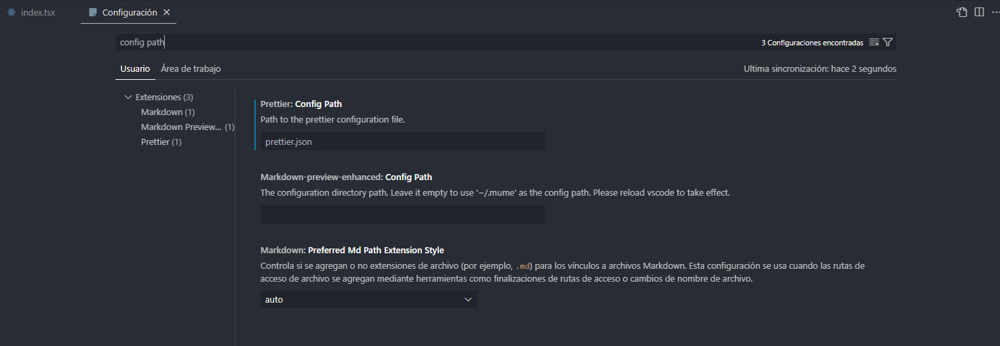

import { Code } from "@bg/docs/code";

# Configuración de prettier🔧

## 📌El archivo `prettier.json` se utiliza para definir las preferencias de formato y estilo en el formateador de código Prettier. Aquí tienes un ejemplo de cómo puedes configurar el archivo `prettier.json` con tus preferencias específicas:

### **🐾Pasos para configurar prettier.json:**

1. Abre un editor de texto y crea un nuevo archivo llamado `prettier.json`.
2. Copia y pega el siguiente código en el archivo `prettier.json`:

<Code>
  {`
  "tabWidth": 4,
  "arrowParens": "avoid",
  "printWidth": 120,
  "proseWrap": "always",
  "useTabs": true,
  "singleQuote": true,
  "bracketSpacing": false,
  "configPath": "${`workspaceFolder`}/.prettierrc"
`}
</Code>

3. Guarda el archivo prettier.json en la raíz de tu proyecto.
4. Establece el prettier.json como archivo de configuración de prettier, esto se hace por medio de una opción del vscode llamada Config path, ahí establecemos su valor en prettier.json de la siguiente manera:

<Code>
  {" "}
  
</Code>
### **🚀Como ejecutar prettier:**

Para ejecutar Prettier y formatear tu código según la configuración establecida en prettier.json, puedes utilizar los siguientes métodos:

Línea de comandos: Abre una terminal en la carpeta raíz de tu proyecto y ejecuta el siguiente comando:

<Code>npx prettier --write</Code>

Esto formatea todos los archivos dentro de la carpeta actual y sus subcarpetas.

**Integración de editor:** Si has instalado la extensión de Prettier en tu editor de código, puedes formatear automáticamente el código utilizando el atajo de teclado correspondiente o la opción en el menú del editor.

Link de la extension: https://marketplace.visualstudio.com/items?itemName=esbenp.prettier-vscode

### **💻Configuración del formateo al guardar:**

Para configurar Prettier para que se ejecute automáticamente cada vez que guardas un archivo, puedes seguir estos pasos:
Asegúrate de tener Prettier y la extensión correspondiente instalados en tu editor de código. Prettier está disponible para varios editores populares como Visual Studio Code, Atom, Sublime Text, entre otros. Verifica que tienes la extensión de Prettier instalada en tu editor.

1. Asegúrate de tener Prettier y la extensión correspondiente instalados en tu editor de código. Prettier está disponible para varios editores populares como Visual Studio Code, Atom, Sublime Text, entre otros. Verifica que tienes la extensión de Prettier instalada en tu editor.

2. Abre la configuración de tu editor. Esto generalmente se hace a través del menú **"Preferences"** (Preferencias) o "Settings" (Configuración) en el editor.

3. Busca la configuración de Prettier. Puede aparecer como **"Prettier"** o **"Format"** en la configuración del editor. Selecciona la configuración correspondiente para Prettier.

4. Dentro de la configuración de Prettier, busca la opción **"Format On Save"** (Formatear al Guardar) y actívala. Esta opción indica al editor que ejecute automáticamente Prettier cada vez que guardes un archivo.

5. Guarda los cambios en la configuración y cierra la ventana de configuración.

A partir de ahora, cuando guardes un archivo en tu editor de código, Prettier se ejecutará automáticamente y formateará el código según las reglas y configuraciones establecidas en tu archivo prettier.json.
